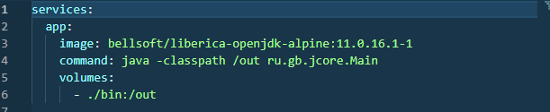

## Урок 1. Компиляция и интерпретация кода

1. Создать приложение с вложенностью пакетов не менее 3х, где будет класс для входа и несколько классов с логикой.
   Скомпилируйте и запустите посредством CLI
   

2. Создать два Docker-образа. Один должен компилировать Java-проект обратно в папку на компьютере пользователя, а второй забирать скомпилированные классы и исполнять их. Пример листинга для docker-compose приведен в презентации семинара
   

   docker-compose-class.yml
   

   docker-compose-exec.yml
   
