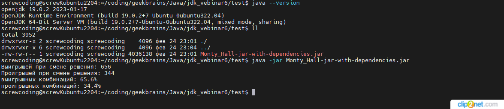

## Урок 6. Управление проектом: сборщики проектов
**В качестве задачи предлагаю вам реализовать код для демонстрации парадокса Монти Холла (Парадокс Монти Холла — Википедия ) и наглядно убедиться в верности парадокса (запустить игру в цикле на 1000 и вывести итоговый счет).**

Необходимо:
- Создать свой Java Maven или Gradle проект;
- Подключите зависимость lombok и возможно какую то математическую библиотеку (напр. commons-math3)
- Самостоятельно реализовать прикладную задачу;
- Сохранить результат игр в одну из коллекций или в какой то библиотечный класс
- Вывести на экран статистику по победам и поражениям 
- В качестве ответа прислать ссылку на репозиторий, в котором присутствует все важные файлы проекта (напр pom.xml)

*запуск джарника на линукс машине с установленной JDK 19*
